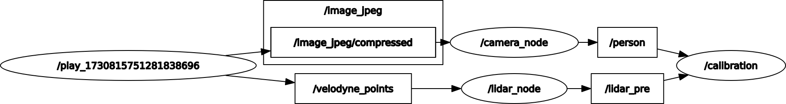
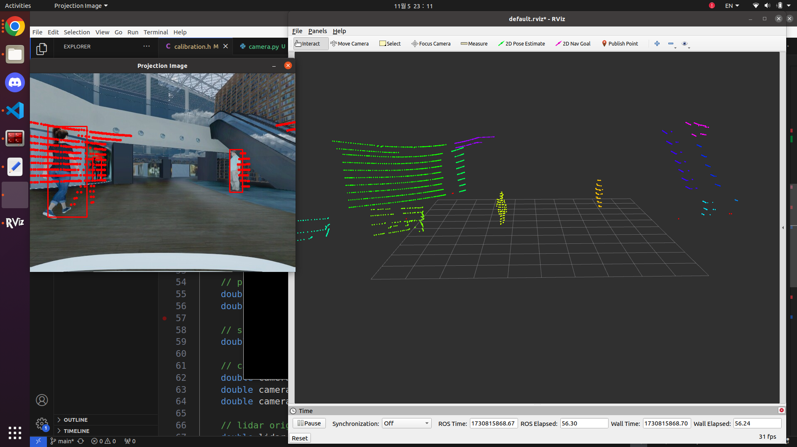
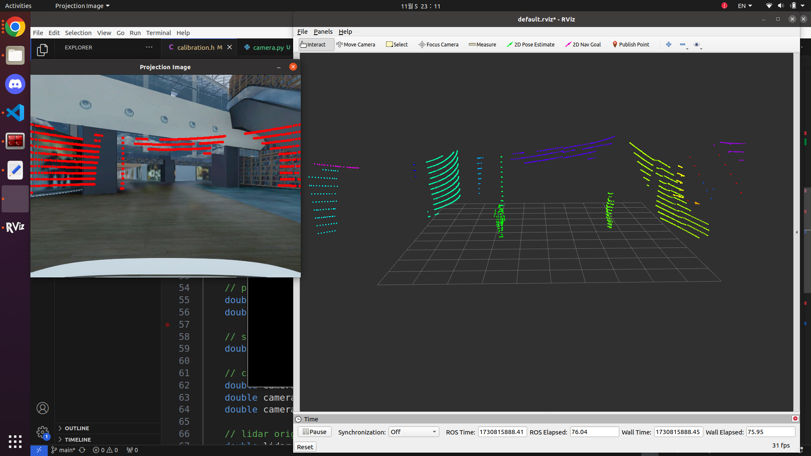
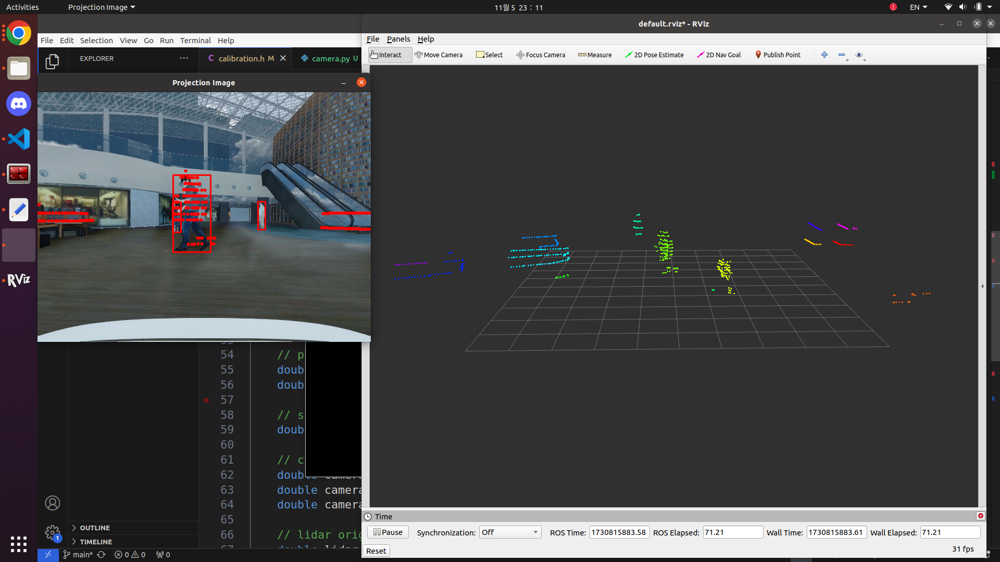

# Camera 3D LiDAR Calibration

## Introduction

Web camera and 3D Lidar calibration code
(https://velog.io/@jinhoyoho/3D-lidar-camera-calibration)

**You have to change intrinsic and extrinsic parameter with my code!**


rqt_graph using ros bag file.
1. Receive camera and lidar raw data.
2. Do preprocess them each.
- lidar -> preprocessing(ROI->Voxel->RANSAC->DBSCAN)
- camera -> yolo (I only detect 'person' class. You can change it at 'camera.py')
3. Do calibration using them and rotation matrix.

## Installation

### Prerequisites (My version)

- Ubuntu = 20.04
- ROS1 Noetic
- Python = 3.10.14
- Pytorch = 1.12.0 (with CUDA)
- Ultralytics

## Clone this repository

```Shell
git clone https://github.com/jinhoyoho/camera_3dlidar_calibration.git
```

## Create a conda virtual environment and activate it (conda is optional)

```Shell
# Create conda virtual environment
conda create -n calibration python=3.10 -y
# Activate conda virtual environment
conda activate calibration

# Install Ultralytics
pip install ultralytics

# Install Pytorch and CUDA
pip install torch==1.12.0+cu116 torchvision==0.13.0+cu116 torchaudio==0.12.0 --extra-index-url https://download.pytorch.org/whl/cu116

```

## Running

```Shell
cd ~/catkin_ws/
catkin_make
```

```Shell
# Execute three execute files.
rosrun camera_3dlidar_calibration camera.py
rosrun camera_3dlidar_calibration lidar_pre
rosrun camera_3dlidar_calibration calibration
```

## Result






